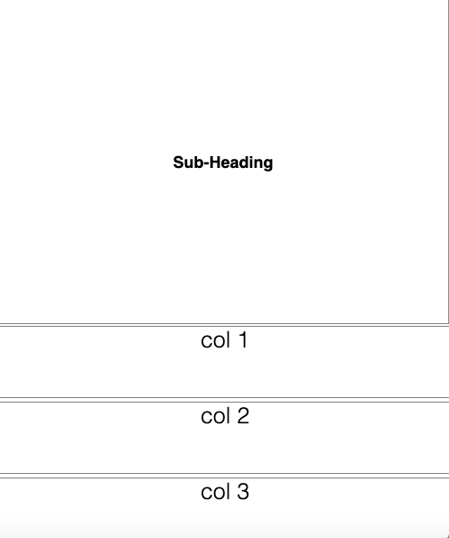

<br/>

## Introduction
#### This is the raw responsive 12 point grid used for the [Experience Canada Project](https://experiencecanada.web.app/). Throughout this README you will find instructions on how to clone this repository, configure the npm settings and use browser-sync to automatically update the browser whenever a change is applied and saved. In addition to this, screenshots are visible further down to evidence what this bare bones grid looks like when viewed on both desktop and mobile.

<br/>

## Configuration 

### Step One
###### Open Command line on either Windows or Mac and type in the following to clone the repo onto your desktop:

```
cd ~/Desktop/

git clone https://github.com/whdesigns/ExperienceCanadaGrid 
```
<br/>

### Step Two
###### Open the cloned repo inside Visual Studio Code on either Windows or Mac.

###### Note: Ensure Node JS is installed. If not [click here](https://nodejs.org/en/) to download it. Once installed npm will be available to use on the terminal. Type....
```
node -v
 ```
###### in the terminal to ensure the latest version has been installed. 

<br/>

### Step Three 
###### Type the following into the terminal to initialize npm and install gulp-cli globally
 ```
npm init
sudo npm install gulp-cli -g
 ```
###### When installing npm various questions will be asked. Press "enter" to skip them. Afterwards a package.json file will automatically be generated or updated.
###### While attempting to install gulp-cli npm will ask for a "password", which is used for the user's computer.
 
###### Type...

 ```
gulp -v
 ```
###### to check if the latest version of gulp has been installed.

  <br />

### Step Four
###### Install gulp-sass and browser-sync by typing the following into the terminial 

 ```
npm install --save-dev gulp gulp-sass browser-sync
 ```
###### This will automatically update the dependencies in the package.JSON file.
 
   <br />

### Step Five:
###### Type the following into the terminal to pull up the website using your localhost with the use of browser-sync

 ```
gulp watch
 ```
###### Now whenever something is updated and saved the browser will automatically refresh to display these changes. 

  <br /> 

## Desktop Screenshots

### Home and Culture Pages


<br/>

### Wildife Page


<br/>

### Landmarks and Sports Pages


<br/>

### Contact Page


<br/>

## Mobile Screenshots

### Home and Culture Pages


<br/>

### Wildife Page


<br/>

### Landmarks and Sports Pages


<br/>

### Contact Page



